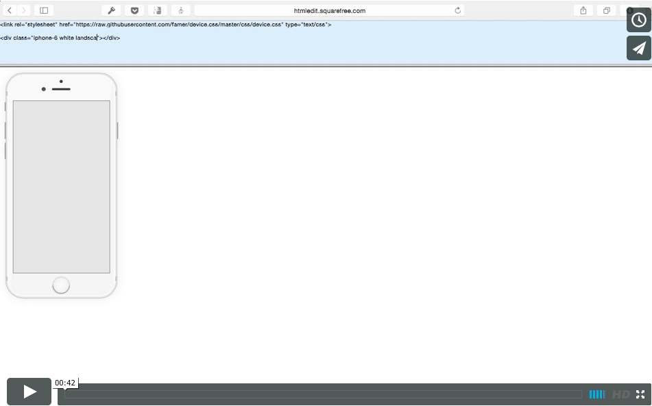

# Device.css

## About
Device.css is a project that helps you to display app screenshots including phones, tablets and other devices easily with one HTML element and pure CSS.

## In the wild

**[Watch the Device.css video demo here](https://vimeo.com/129261286)**  

## Usage
* Include target CSS file to your page, like `device.css`
* Add class that confirms target device to your HTML element.
 
List of existing classes:

* iphone-6
* ipad-mini-3
* macbook-air
* imac
 
You can add color and orientation classes optionaly. Colors: space-gray, silver, gold. Orientations: landscape.

## License
Licensed under [MIT](http://opensource.org/licenses/MIT) License
