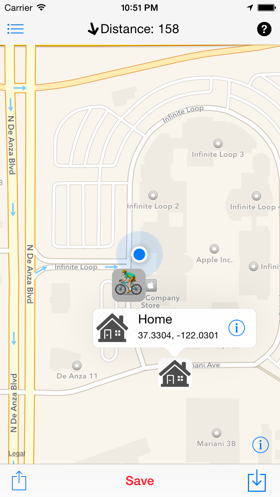
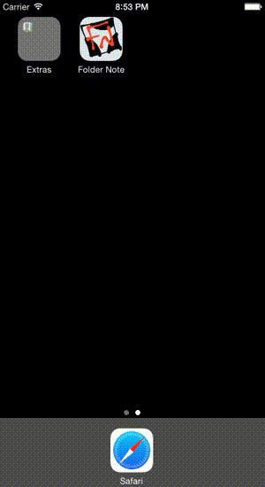

### About

Device.css is a project helping you to display app screenshots including phones, tablets and screens easily with pure css.

### Examples

Example of usage

```
	<div class="iphone-6 white"></div>
```

#### Result
<div class="iphone-6 white" style="font-size: 4px;">
	
</div>
<div class="iphone-6 black" style="font-size: 4px;">
	
</div>

### Usage

1. Include `device.css` or generate your custom subset of devices.
`<link rel="stylesheet" type="text/css" href="css/device.css">`
2. Add model name from the [list](#modelslist) to your div's classes  
`<div class="iphone-6 white"></div>`
3. You can scale the phone using font-size style, with font-size of 12px being 100% screen size, 6px - 50% etc.  
`<div class="iphone-6 white" style="font-size:6px"></div>`


### CSSes list:

- device.css: you need all available devices
- phones.css: you need all available phone devices(iPhones, Samsungs, BBRY)
- tablet.css: you nee all available tablets(iPads, Android Tablets)
- iphone.css: all iphone models(iPhone 4S, iPhone 5, iPhone 6, iPhone 6 Plus)
- samsung.css: all samsung devices (Galaxy S, Galaxy S3, Galaxy S4)

Separate css for separate devices:

- iphone-6.css: only iPhone 6 appearance
- galaxys5.css: only Samsung Galaxy S5

### Supported devices list (will continue to grow):

- iPhone 6
	- base class: *iphone-6*
	- required color scheme class *black* or *white*
	- optional class *landscape* for horizontal orientation

### License

Device.css and its sources are released under [MIT](http://opensource.org/licenses/MIT) license.
