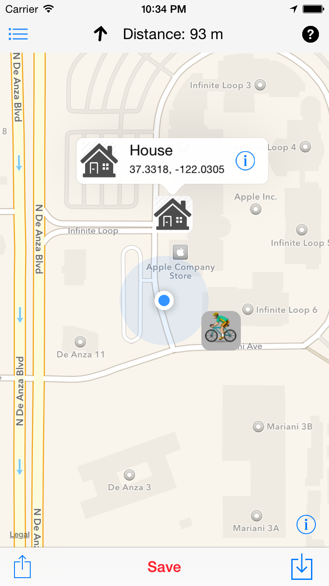

### About

Device.css is a project where we explore how much we can do with pure CSS. It helps you display app screenshots including phones, tablets and screens easily or do anything creative you can think of using our single element devices. They are scalable and use CSS3 styles to allow for vector graphics that looks sharp on any resolution.

### Example

```
	<div class="iphone-6 white"></div>
```

### Results


<div class="iphone-6 white" style="font-size: 4px; vertical-align: middle;">
        
</div>
<div class="iphone-6 black" style="font-size: 4px; vertical-align: middle;">
	<video width="250" autoplay loop>
	  <source src="background/videos/fnscreencast.mp4" type="video/mp4" />
	</video>
</div>

<p>Check out more extensive demo here (insert codepen link when it's available)</p>

### Usage

1. Include `iphone6.css` or generate your custom subset of devices.
`<link rel="stylesheet" type="text/css" href="css/iphone6.css">`
2. Add model name from the [list](#modelslist) to your div's classes  
`<div class="iphone-6 white"></div>`
3. You can scale the phone using font-size style, with font-size of 12px being 100% screen size, 6px - 50% etc.  
`<div class="iphone-6 white" style="font-size:6px"></div>`


### CSSes list:

- iphone6.css: iPhone 6 Silver, Space Gray, vertical and landscape
	- iphone6.white.css: iPhone 6 Silver vertical
	- iphone6.white.landscape.css: iPhone 6 Silver vertical and landscape
	- iphone6.black.css: iPhone 6 Space Gray vertical
	- iphone6.black.landscape.css: iPhone 6 Space Gray vertical and landscape

### Supported devices list with css options (will continue to grow):

- iPhone 6
	- base css class: *iphone-6*
	- required color scheme CSS class *black* or *white*
	- optional CSS class *landscape* for horizontal orientation  
Example: `<div class="iphone-6 black landscape"></div>`
- iPad Mini 3
	- base css class: *ipad-mini-3*
	- required color scheme CSS class *black*, *white* or *gold*
- Macbook Air
	- base css class: *macbook-air*
- Mac
	- base css class: *mac*

### Requirements
Safari, Chrome, Opera, FireFox  
IE 10+ 

### Sources
Sources available in repository [famer/device.css](http://github.com/famer/device.css)

### Issues 

If you find some bugs or issues feel free to submit report in [issues section](https://github.com/famer/device.css/issues)

### License

Device.css and its sources are released under [MIT](http://opensource.org/licenses/MIT) license.

### Share

<div id="fb-root"></div>
<script>(function(d, s, id) {
  var js, fjs = d.getElementsByTagName(s)[0];
  if (d.getElementById(id)) return;
  js = d.createElement(s); js.id = id;
  js.src = "//connect.facebook.net/en_GB/sdk.js#xfbml=1&version=v2.3&appId=154079051320662";
  fjs.parentNode.insertBefore(js, fjs);
}(document, 'script', 'facebook-jssdk'));</script>

<div style="float:left; margin: -4px 10px 0 0;" class="fb-like" data-href="http://famer.github.io/device.css/" data-layout="button_count" data-action="like" data-show-faces="false" data-share="false"></div>
<a style="float:left;" href="https://twitter.com/share" class="twitter-share-button" data-url="http://famer.github.io/device.css/" data-via="locationsphere">Tweet</a> <script>!function(d,s,id){var js,fjs=d.getElementsByTagName(s)[0],p=/^http:/.test(d.location)?'http':'https';if(!d.getElementById(id)){js=d.createElement(s);js.id=id;js.src=p+'://platform.twitter.com/widgets.js';fjs.parentNode.insertBefore(js,fjs);}}(document, 'script', 'twitter-wjs');</script>

### Copyright
Devices.css are created by Alex Inkin with support of [Timur Tatarshaov](http://famer.github.io). You are free to use it anywhere you like.  
Alex Inkin: If you appreciate this project and want to say thank you - you can listen to my music on [waterplea.bandcamp.com](http://waterplea.bandcamp.com).  
© 2015

